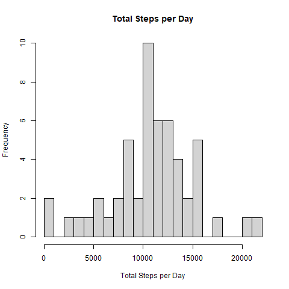
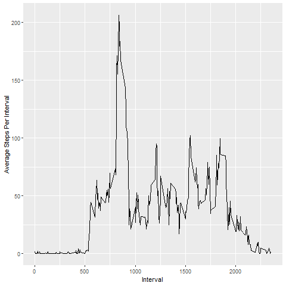
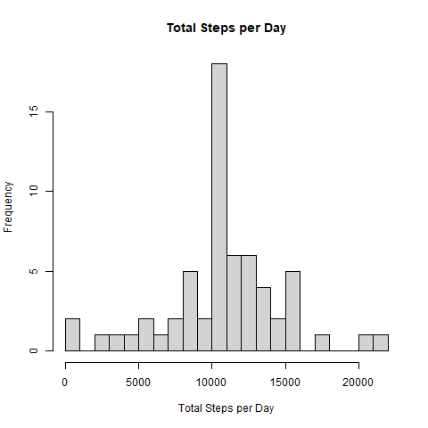
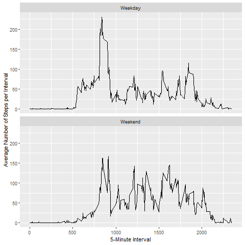

# Reproducible Research: Peer Assessment 1

## 1. Loading and Preprocessing the data.
```r
unzip(zipfile="repdata_data_activity.zip")
activity <- read.csv("activity.csv", header = TRUE)
```

## 2. What is Mean Total Number of Steps Taken Per Day?

```r
library(dplyr)
```
```r
activity_by_day <- group_by(activity, date) %>% 
        summarize(total_steps_per_day = sum(steps))
hist(activity_by_day$total_steps_per_day, xlab = "Total Steps per Day", main = "Total Steps per Day", breaks = 20)
```



```r
mean(activity_by_day$total_steps_per_day, na.rm = TRUE)
```

```r
## [1] 10766.19
```

```r
median(activity_by_day$total_steps_per_day, na.rm = TRUE)
```

```r
## [1] 10765
```

## 3. What is the Average Daily Activity Pattern?

```r
library(dplyr)
library(ggplot2)
```
```r
activity_by_interval <- group_by(activity, interval) %>%
        summarize(average_steps_per_interval = mean(steps, na.rm = TRUE))     
ggplot(data = activity_by_interval, mapping = aes(x = interval, y = average_steps_per_interval)) +
        geom_line() +
        ylab("Average Steps Per Interval") +
        xlab("Interval")
```



The maximum activity can be seen in the 835th interval.

```r
max <- arrange(activity_by_interval,desc(average_steps_per_interval))
max[1,]
```

```r
##     interval        average_steps_per_interval
##     835             206.
```

## 4. Imputing Missing Values

I use the average of every interval to replace the NAs on each corresponding interval.

```r
library(dplyr)
```

```r
colSums(is.na(activity))
```
```r
##      steps   date    interval
##      2304    0       0
```
We can see here that there are 2304 NAs in steps column.
```r
replacewithmean <- function(x) replace(x, is.na(x), mean(x, na.rm = TRUE))
mean_activity <- activity%>% group_by(interval) %>% mutate(steps= replacewithmean(steps))
```

```r
head(mean_activity)
```
```r
##      steps   date            interval        weekday         weekend
## 1.   1.72    2012-10-01      0               Monday          Weekday
## 2.   0.340   2012-10-01      5               Monday          Weekday
## 3.   0.132   2012-10-01      10              Monday          Weekday
## 4.   0.51    2012-10-01      15              Monday          Weekday
## 5.   0.0755  2012-10-01      20              Monday          Weekday
## 6.   2.09    2012-10-01      25              Monday          Weekday

```
It can be seen in the table that all the NAs are replaced by the average of every interval.
```r
mean_activity_by_day <- group_by(mean_activity, date) %>% 
        summarize(total_steps_per_day = sum(steps))
hist(mean_activity_by_day$total_steps_per_day,xlab = "Total Steps per Day",main = "Total Steps per Day", breaks = 20)
```

```r
mean(mean_activity_by_day$total_steps_per_day, na.rm = TRUE)
```

```r
## 10766.19 
```

```r
median(mean_activity_by_day$total_steps_per_day, na.rm = TRUE)
```

```r
## 10766.19 
```

## 5. Are there Differences in Activity Patterns between Weekdays and Weekends?

```r
library(dplyr)
library(ggplot2)
```
```r
mean_activity$date <- as.Date(mean_activity$date)
mean_activity$weekday <- weekdays(mean_activity$date)
mean_activity$weekend <- ifelse(mean_activity$weekday=="Saturday" | mean_activity$weekday=="Sunday", "Weekend", "Weekday")
mean_activity_by_interval <- mean_activity %>% 
        group_by(interval, weekend) %>%
        summarize(average_steps_per_interval = mean(steps, na.rm = TRUE))
```
Now, we'll plot the data in weekends and weekdays and see if there are any significant difference.

```r
ggplot(data = mean_activity_by_interval) +
        geom_line(mapping = aes(x = interval, y = average_steps_per_interval)) +
        facet_wrap(~weekend, nrow = 2) +
        xlab("5-Minute Interval") +
        ylab("Average Number of Steps per Interval")
```

